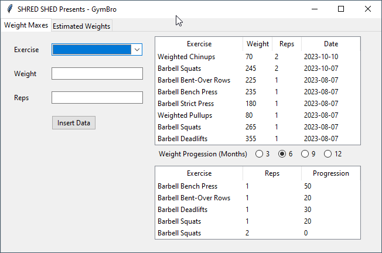
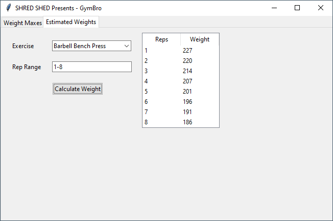

# ShredSheds_GymBro

### Description

GymBro is a Python based gui with the purpose of storing PR (personal record) data from your workouts. With storing it in a sqlite3 database file, you will no longer have to either store PR's in a notebook, excel file or not at all.\
(I'm sure there are other applications that store this data but this is also a fun projec to get more into coding)

### Precompiled EXE (Beta)

https://github.com/634morse/GymBro_EXE/archive/refs/tags/beta.zip

Hash Verification: 354689015a01d64843cd919f544190d494371bda


<details>
<summary><big>Functionality</big></summary>

On top of being able to store your PR's in a database, the application can also take this data and
- #### Progression Table
    - Displays progress over a period of 3, 6, 9 or 12 months
    - it grabs oldest and newest data within the selected time range for recorded exercises and gets the difference (It does this for each recorded rep range as well, so you can see progress even if your 1RM has not improved yet)
- #### Epsley Calculator
    - Calculates estimated weight to lift for a range of reps based on the Epsley equation and recorded 1RM data stored
    - https://www.vcalc.com/wiki/epley-formula-1-rep-max

</details>

<details>
<summary><big>Images</big></summary>

### The main page 

### The estimated weights tab (Eplsey Calculator)



</details>

<details>
<summary><big>Installation</big></summary>

#### There are 3 ways this can be installed

### Precompiled exe (WindowswADADa)

Every Version will come with a precompiled exe built from cx_freeze and will be available above along with a hash for verification. This option allows for turn-key use without needing to install any dependencies.

- Download the zip file and extract it wherever you would like
- run gymbro.exe
- if you want to verify the hash you can run the following in a command prompt\
`certutil -hashfile <c:\path\to\gymbro.exe>`

### Precompile the exe yourself

If you don't trust downloading the exe file yourself but still want the simplicity of an exe, below is a cx_freeze script you can run to build it yourself.

Install cx_freeze\
```pip install cx_freeze```

Run the following script with python
```
import sys
from cx_Freeze import setup, Executable

# Dependencies are automatically detected, but it might need fine tuning.
build_exe_options = {
    "packages": ["tkinter", "ttkwidgets"],
    "includes": ["modules.gui", "modules.db_handler", "data.exercises"],
}

# base="Win32GUI" should be used only for Windows GUI app
base = "Win32GUI" if sys.platform == "win32" else None

setup(
    name="GymBro",
    version="0.1",
    description="WeightLifting PR App",
    options={"build_exe": build_exe_options},
    executables=[Executable("gymbro.py", base=base, icon="data/images/logo.ico")],
)
```
</details>